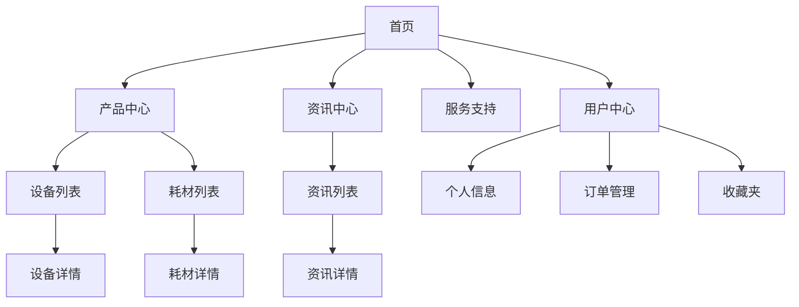

# 3D打印设备销售网站 - 产品需求文档（PRD）

## 1. 项目概述

### 1.1 项目背景
本网站旨在打造一个专业的3D打印设备销售平台，为用户提供一站式的3D打印解决方案，包括设备销售、耗材供应和行业资讯服务。

### 1.2 目标用户
- **个人用户**：3D打印爱好者、创客、设计师
- **企业用户**：制造业、教育机构、科研院所
- **专业用户**：工程师、产品设计师

### 1.3 核心价值
- 提供高质量的3D打印设备和耗材
- 提供专业的技术支持和售后服务
- 提供最新的3D打印行业资讯和技术分享

---

## 2. 功能需求

### 2.1 首页

| 功能模块 | 功能描述 | 优先级 |
| :--- | :--- | :--- |
| Hero Banner | 展示主打产品或促销活动 | 高 |
| 产品分类导航 | 快速导航到设备、耗材分类 | 高 |
| 热门产品推荐 | 展示热销3D打印机 | 高 |
| 资讯动态 | 展示最新行业资讯 | 中 |
| 品牌介绍 | 展示企业实力和优势 | 中 |

### 2.2 产品中心

#### 2.2.1 设备展示

| 功能模块 | 功能描述 | 优先级 |
| :--- | :--- | :--- |
| 设备分类 | 按类型（FDM、SLA、SLS等）分类展示 | 高 |
| 设备列表 | 展示设备图片、名称、价格、关键参数 | 高 |
| 设备详情页 | 详细展示设备参数、特点、应用场景 | 高 |
| 对比功能 | 支持多款设备对比 | 中 |

#### 2.2.2 耗材展示

| 功能模块 | 功能描述 | 优先级 |
| :--- | :--- | :--- |
| 耗材分类 | 按材料类型（PLA、ABS、树脂等）分类 | 高 |
| 耗材列表 | 展示耗材规格、颜色、价格 | 高 |
| 耗材详情页 | 详细展示耗材特性、适用机型 | 高 |

### 2.3 资讯中心

| 功能模块 | 功能描述 | 优先级 |
| :--- | :--- | :--- |
| 资讯列表 | 展示资讯标题、摘要、发布时间 | 高 |
| 资讯详情页 | 完整展示资讯内容 | 高 |
| 资讯分类 | 按类别（技术、行业动态、应用案例）分类 | 中 |
| 搜索功能 | 支持关键词搜索 | 中 |

### 2.4 用户中心

| 功能模块 | 功能描述 | 优先级 |
| :--- | :--- | :--- |
| 用户注册/登录 | 支持账号密码、手机验证码登录 | 高 |
| 个人信息管理 | 修改个人资料、密码 | 高 |
| 订单管理 | 查看订单状态、历史订单 | 高 |
| 收藏夹 | 收藏产品和资讯 | 中 |

### 2.5 购物系统

| 功能模块 | 功能描述 | 优先级 |
| :--- | :--- | :--- |
| 购物车 | 添加/删除商品、修改数量 | 高 |
| 结算功能 | 确认订单、选择支付方式 | 高 |
| 支付集成 | 支持多种支付方式 | 高 |

### 2.6 服务支持

| 功能模块 | 功能描述 | 优先级 |
| :--- | :--- | :--- |
| 常见问题（FAQ） | 解答用户常见疑问 | 中 |
| 联系我们 | 提供联系方式和在线咨询 | 中 |
| 售后服务 | 保修政策、维修申请 | 中 |

---

## 3. 非功能需求

### 3.1 性能需求
- 页面加载时间 < 3秒
- 支持1000+并发用户访问

### 3.2 设计需求
- 响应式设计，支持PC、平板、移动端
- 现代简洁的UI风格
- 品牌色调：科技蓝为主色

### 3.3 安全性需求
- 用户数据加密存储
- 支付信息安全传输
- 防止SQL注入和XSS攻击

---

## 4. 页面结构

---

## 5. 数据模型

### 5.1 产品表（products）

| 字段名 | 类型 | 说明 |
| :--- | :--- | :--- |
| id | int | 主键ID |
| name | varchar | 产品名称 |
| category | varchar | 产品分类（设备/耗材） |
| sub_category | varchar | 子分类 |
| price | decimal | 价格 |
| description | text | 产品描述 |
| specs | json | 技术参数 |
| images | json | 产品图片列表 |
| stock | int | 库存数量 |
| is_active | bool | 是否上架 |

### 5.2 资讯表（articles）

| 字段名 | 类型 | 说明 |
| :--- | :--- | :--- |
| id | int | 主键ID |
| title | varchar | 文章标题 |
| content | text | 文章内容 |
| category | varchar | 资讯分类 |
| author | varchar | 作者 |
| publish_time | datetime | 发布时间 |
| views | int | 浏览量 |

### 5.3 用户表（users）

| 字段名 | 类型 | 说明 |
| :--- | :--- | :--- |
| id | int | 主键ID |
| username | varchar | 用户名 |
| phone | varchar | 手机号 |
| password | varchar | 加密密码 |
| email | varchar | 邮箱 |
| created_at | datetime | 创建时间 |

---

## 6. 技术选型

### 6.1 前端技术栈
- **框架**: React 18 + TypeScript
- **UI组件**: Ant Design
- **状态管理**: Redux Toolkit
- **路由**: React Router
- **样式**: TailwindCSS 3
- **图标**: Lucide React

### 6.2 后端技术栈
- **框架**: Node.js + Express
- **数据库**: MySQL
- **ORM**: Sequelize
- **API文档**: Swagger
- **支付集成**: 支付宝/微信支付SDK

### 6.3 部署方案
- **前端**: Vercel / Netlify
- **后端**: 阿里云ECS
- **数据库**: 阿里云RDS
- **CDN**: 阿里云CDN

---

## 7. 开发计划

### 7.1 第一阶段：基础架构（2周）
- 项目初始化
- 前端框架搭建
- 后端API框架搭建
- 数据库设计与初始化

### 7.2 第二阶段：核心功能（4周）
- 产品展示模块
- 资讯展示模块
- 用户认证模块

### 7.3 第三阶段：购物系统（3周）
- 购物车功能
- 订单管理
- 支付集成

### 7.4 第四阶段：优化完善（2周）
- 性能优化
- 移动端适配
- 测试与上线

---

## 8. 附录

### 8.1 产品分类规划

**设备分类：**
- FDM 桌面级打印机
- SLA 光固化打印机
- SLS 选择性激光烧结机
- 工业级大型打印机

**耗材分类：**
- PLA 耗材
- ABS 耗材
- PETG 耗材
- 光敏树脂
- 金属粉末

### 8.2 资讯分类规划
- 行业动态
- 技术教程
- 应用案例
- 新品发布
