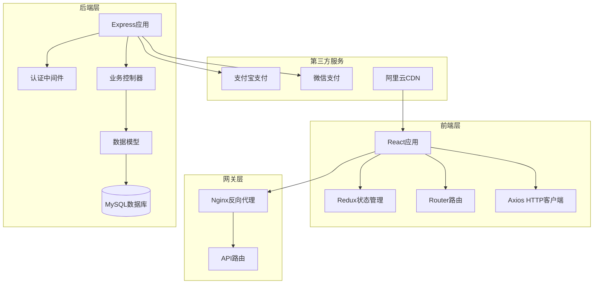
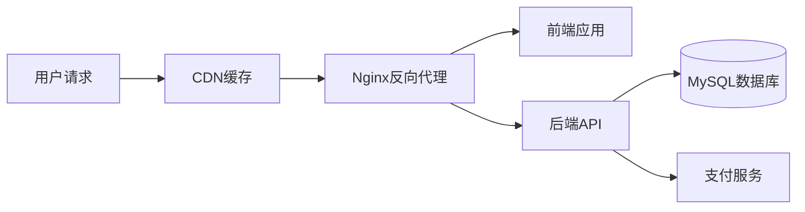

# 3D打印设备销售网站 - 技术架构文档

## 1. 架构概述

### 1.1 架构风格
采用经典的**前后端分离**架构，前端负责展示和交互，后端提供RESTful API服务。

### 1.2 设计原则
- **分层架构**：清晰的职责划分，便于维护和扩展
- **模块化设计**：功能解耦，独立开发和测试
- **RESTful API**：标准化接口设计，便于集成
- **安全性优先**：用户数据加密、防止注入攻击

### 1.3 系统架构图



---

## 2. 前端架构

### 2.1 技术栈

| 技术 | 版本 | 用途 |
| :--- | :--- | :--- |
| React | 18.x | 前端框架 |
| TypeScript | 5.x | 类型安全 |
| Ant Design | 5.x | UI组件库 |
| Redux Toolkit | 1.x | 状态管理 |
| React Router | 6.x | 路由管理 |
| TailwindCSS | 3.x | CSS框架 |
| Lucide React | 0.x | 图标库 |
| Axios | 1.x | HTTP客户端 |

### 2.2 目录结构

```
frontend/
├── src/
│   ├── components/          # 通用组件
│   │   ├── Header/         # 页头导航
│   │   ├── Footer/         # 页脚
│   │   ├── ProductCard/    # 产品卡片
│   │   └── ArticleCard/    # 资讯卡片
│   ├── pages/              # 页面组件
│   │   ├── Home/           # 首页
│   │   ├── Products/       # 产品中心
│   │   ├── Articles/       # 资讯中心
│   │   ├── UserCenter/     # 用户中心
│   │   └── Support/        # 服务支持
│   ├── store/              # Redux状态管理
│   │   ├── slices/         # 状态切片
│   │   └── index.ts        # Store配置
│   ├── api/                # API调用
│   │   ├── products.ts     # 产品相关API
│   │   ├── articles.ts     # 资讯相关API
│   │   └── users.ts        # 用户相关API
│   ├── types/              # TypeScript类型定义
│   ├── utils/              # 工具函数
│   └── App.tsx             # 根组件
├── public/                 # 静态资源
├── package.json
├── tsconfig.json
├── tailwind.config.js
└── vite.config.ts
```

### 2.3 状态管理设计

| Slice名称 | 管理状态 | 主要操作 |
| :--- | :--- | :--- |
| products | 产品列表、筛选条件 | fetchProducts, setFilters |
| cart | 购物车商品 | addToCart, removeFromCart, updateQuantity |
| user | 用户信息、登录状态 | login, logout, updateProfile |
| articles | 资讯列表 | fetchArticles |

### 2.4 页面路由

| 路径 | 组件 | 说明 |
| :--- | :--- | :--- |
| / | Home | 首页 |
| /products | Products | 产品列表 |
| /products/:id | ProductDetail | 产品详情 |
| /articles | Articles | 资讯列表 |
| /articles/:id | ArticleDetail | 资讯详情 |
| /user | UserCenter | 用户中心 |
| /user/orders | OrderList | 订单列表 |
| /support | Support | 服务支持 |

---

## 3. 后端架构

### 3.1 技术栈

| 技术 | 版本 | 用途 |
| :--- | :--- | :--- |
| Node.js | 20.x | 运行环境 |
| Express | 4.x | Web框架 |
| MySQL | 8.x | 数据库 |
| Sequelize | 6.x | ORM |
| JWT | 9.x | 身份认证 |
| bcrypt | 5.x | 密码加密 |
| Swagger | 4.x | API文档 |

### 3.2 目录结构

```
backend/
├── src/
│   ├── controllers/        # 控制器
│   │   ├── product.ts      # 产品控制器
│   │   ├── article.ts      # 资讯控制器
│   │   ├── user.ts         # 用户控制器
│   │   └── order.ts        # 订单控制器
│   ├── models/             # 数据模型
│   │   ├── Product.ts      # 产品模型
│   │   ├── Article.ts      # 资讯模型
│   │   ├── User.ts         # 用户模型
│   │   └── Order.ts        # 订单模型
│   ├── routes/             # 路由定义
│   │   ├── product.ts      # 产品路由
│   │   ├── article.ts      # 资讯路由
│   │   ├── user.ts         # 用户路由
│   │   └── order.ts        # 订单路由
│   ├── middleware/         # 中间件
│   │   ├── auth.ts         # 认证中间件
│   │   └── error.ts        # 错误处理
│   ├── services/           # 业务服务
│   │   ├── payment.ts      # 支付服务
│   │   └── email.ts        # 邮件服务
│   ├── config/             # 配置文件
│   │   ├── database.ts     # 数据库配置
│   │   └── jwt.ts          # JWT配置
│   └── app.ts              # 应用入口
├── package.json
├── tsconfig.json
└── .env                    # 环境变量
```

### 3.3 数据库设计

#### 3.3.1 产品表（products）

| 字段名 | 类型 | 约束 | 说明 |
| :--- | :--- | :--- | :--- |
| id | INT | PRIMARY KEY, AUTO_INCREMENT | 主键ID |
| name | VARCHAR(255) | NOT NULL | 产品名称 |
| category | VARCHAR(50) | NOT NULL | 产品分类 |
| sub_category | VARCHAR(50) | | 子分类 |
| price | DECIMAL(10,2) | NOT NULL | 价格 |
| description | TEXT | | 产品描述 |
| specs | JSON | | 技术参数 |
| images | JSON | | 产品图片列表 |
| stock | INT | DEFAULT 0 | 库存数量 |
| is_active | BOOLEAN | DEFAULT true | 是否上架 |
| created_at | DATETIME | DEFAULT CURRENT_TIMESTAMP | 创建时间 |
| updated_at | DATETIME | DEFAULT CURRENT_TIMESTAMP ON UPDATE | 更新时间 |

#### 3.3.2 资讯表（articles）

| 字段名 | 类型 | 约束 | 说明 |
| :--- | :--- | :--- | :--- |
| id | INT | PRIMARY KEY, AUTO_INCREMENT | 主键ID |
| title | VARCHAR(255) | NOT NULL | 文章标题 |
| content | TEXT | NOT NULL | 文章内容 |
| category | VARCHAR(50) | | 资讯分类 |
| author | VARCHAR(100) | | 作者 |
| publish_time | DATETIME | DEFAULT CURRENT_TIMESTAMP | 发布时间 |
| views | INT | DEFAULT 0 | 浏览量 |
| created_at | DATETIME | DEFAULT CURRENT_TIMESTAMP | 创建时间 |

#### 3.3.3 用户表（users）

| 字段名 | 类型 | 约束 | 说明 |
| :--- | :--- | :--- | :--- |
| id | INT | PRIMARY KEY, AUTO_INCREMENT | 主键ID |
| username | VARCHAR(100) | UNIQUE, NOT NULL | 用户名 |
| phone | VARCHAR(20) | UNIQUE | 手机号 |
| password | VARCHAR(255) | NOT NULL | 加密密码 |
| email | VARCHAR(100) | UNIQUE | 邮箱 |
| avatar | VARCHAR(255) | | 头像URL |
| created_at | DATETIME | DEFAULT CURRENT_TIMESTAMP | 创建时间 |
| updated_at | DATETIME | DEFAULT CURRENT_TIMESTAMP ON UPDATE | 更新时间 |

#### 3.3.4 订单表（orders）

| 字段名 | 类型 | 约束 | 说明 |
| :--- | :--- | :--- | :--- |
| id | VARCHAR(36) | PRIMARY KEY | 订单编号 |
| user_id | INT | FOREIGN KEY | 用户ID |
| items | JSON | NOT NULL | 订单商品 |
| total_price | DECIMAL(10,2) | NOT NULL | 总金额 |
| status | VARCHAR(20) | DEFAULT 'pending' | 订单状态 |
| payment_method | VARCHAR(50) | | 支付方式 |
| created_at | DATETIME | DEFAULT CURRENT_TIMESTAMP | 创建时间 |

#### 3.3.5 收藏表（favorites）

| 字段名 | 类型 | 约束 | 说明 |
| :--- | :--- | :--- | :--- |
| id | INT | PRIMARY KEY, AUTO_INCREMENT | 主键ID |
| user_id | INT | FOREIGN KEY | 用户ID |
| product_id | INT | FOREIGN KEY | 产品ID |
| created_at | DATETIME | DEFAULT CURRENT_TIMESTAMP | 创建时间 |

### 3.4 API接口设计

#### 3.4.1 产品接口

| 方法 | 路径 | 描述 | 认证 |
| :--- | :--- | :--- | :--- |
| GET | /api/products | 获取产品列表 | 否 |
| GET | /api/products/:id | 获取产品详情 | 否 |
| POST | /api/products | 创建产品 | 是(管理员) |
| PUT | /api/products/:id | 更新产品 | 是(管理员) |
| DELETE | /api/products/:id | 删除产品 | 是(管理员) |

#### 3.4.2 资讯接口

| 方法 | 路径 | 描述 | 认证 |
| :--- | :--- | :--- | :--- |
| GET | /api/articles | 获取资讯列表 | 否 |
| GET | /api/articles/:id | 获取资讯详情 | 否 |
| POST | /api/articles | 创建资讯 | 是(管理员) |
| PUT | /api/articles/:id | 更新资讯 | 是(管理员) |
| DELETE | /api/articles/:id | 删除资讯 | 是(管理员) |

#### 3.4.3 用户接口

| 方法 | 路径 | 描述 | 认证 |
| :--- | :--- | :--- | :--- |
| POST | /api/users/register | 用户注册 | 否 |
| POST | /api/users/login | 用户登录 | 否 |
| GET | /api/users/profile | 获取用户信息 | 是 |
| PUT | /api/users/profile | 更新用户信息 | 是 |
| PUT | /api/users/password | 修改密码 | 是 |

#### 3.4.4 订单接口

| 方法 | 路径 | 描述 | 认证 |
| :--- | :--- | :--- | :--- |
| GET | /api/orders | 获取用户订单列表 | 是 |
| GET | /api/orders/:id | 获取订单详情 | 是 |
| POST | /api/orders | 创建订单 | 是 |
| PUT | /api/orders/:id/status | 更新订单状态 | 是(管理员) |

---

## 4. 部署与运维

### 4.1 部署架构



### 4.2 环境配置

**开发环境：**
- 前端：`http://localhost:5173`
- 后端：`http://localhost:3000`
- 数据库：`localhost:3306`

**生产环境：**
- 前端：通过CDN加速
- 后端：部署在阿里云ECS
- 数据库：阿里云RDS MySQL

### 4.3 安全措施

| 措施 | 说明 |
| :--- | :--- |
| HTTPS | 全站HTTPS加密 |
| JWT认证 | 无状态身份认证 |
| 密码加密 | bcrypt加密存储 |
| SQL注入防护 | Sequelize参数化查询 |
| XSS防护 | 前端转义 + 后端过滤 |
| 接口限流 | 防止恶意请求 |

---

## 5. 代码规范

### 5.1 前端规范

- 使用TypeScript严格模式
- 组件命名采用PascalCase
- 函数命名采用camelCase
- 使用ESLint + Prettier进行代码检查
- 组件文件放在components目录

### 5.2 后端规范

- 使用TypeScript
- 控制器方法命名采用camelCase
- 使用ESLint进行代码检查
- 错误处理统一使用中间件
- 日志记录使用winston

---

## 6. 测试计划

### 6.1 前端测试
- 单元测试：Jest + React Testing Library
- E2E测试：Cypress
- 测试覆盖率目标：80%以上

### 6.2 后端测试
- 单元测试：Jest
- API测试：Supertest
- 数据库测试：使用测试数据库

---

## 7. 性能优化

| 优化方向 | 措施 |
| :--- | :--- |
| 前端打包 | 代码分割、懒加载 |
| 图片优化 | WebP格式、CDN加速 |
| 缓存策略 | HTTP缓存、本地存储 |
| 数据库优化 | 索引优化、查询优化 |
| API优化 | 分页、响应缓存 |
